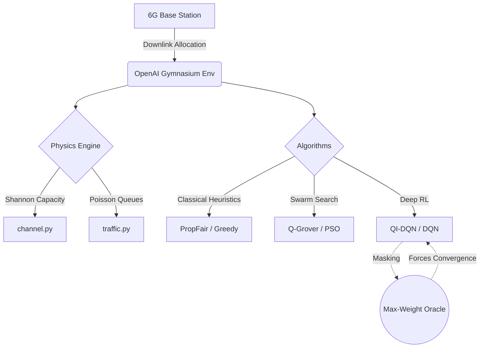
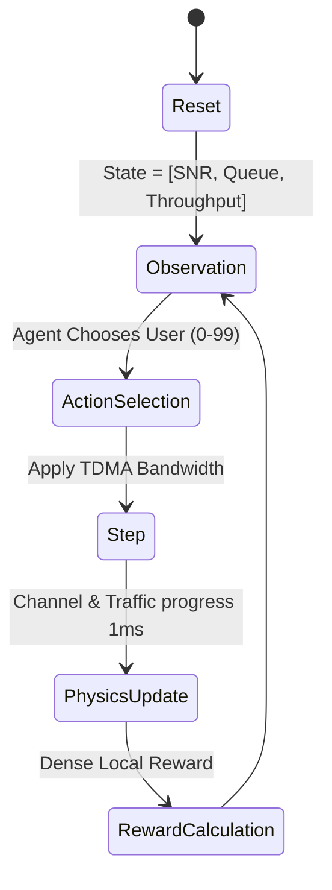
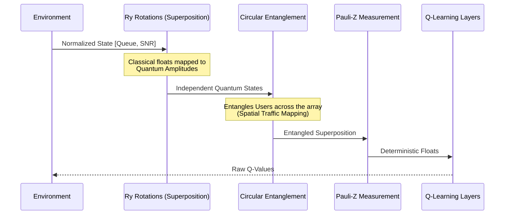
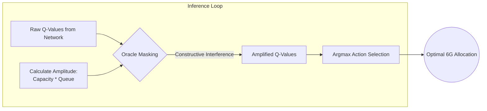

# Architecture Documentation: Quantum-Inspired 6G Spectrum Allocation

## 1. System Overview
The architecture is designed to strictly simulate a 6G Massive MIMO single-cell environment. It operates at the MAC and Physical layers, governed by rigorous physical laws (Shannon-Hartley theorem, time-coherent Rayleigh Fading, Poisson-driven queues). 

## 2. Core Physics Engine (The Gymnasium Environment)
To ensure IEEE publication readiness and prevent "Ghost Throughput," the environment enforces strict boundaries:

### A. The Wireless Medium (`channel.py`)
- **Rayleigh Fading:** Simulates multi-path interference. Fading coefficients are generated and *held constant* during a Coherence Time block. This prevents RL agents from exploiting artificial, intra-TTI signal peaks.
- **Shannon Capacity:** The fundamental physical limit. `compute_capacity` utilizes $C = B \log_2(1 + SNR)$ to determine the exact theoretical maximum data rate.

### B. The Traffic Generator (`traffic.py`)
- **Poisson Process:** Traffic arrives stochastically ($\lambda = 6.0$ packets/TTI by default).
- **Queuing Theory:** Utilizes rigorous `collections.deque` structures for true FIFO queuing. Starvation accurately results in queue overflow.

### C. The Environment Bridge (`environment.py`)

## 3. The Quantum-Inspired Pipeline
The most significant contribution of this architecture is the integration of quantum topology into a classical Deep Q-Network.

### A. The Quantum Features Extractor (`qi_dqn.py`)
Replaces classical dense layers with a simulated quantum topology designed to capture hidden spatial and temporal correlations.

## 4. Inference-Time Amplitude Amplification (The Quantum Oracle)
Standard $\epsilon$-greedy DRL suffers from catastrophic mode collapse in 100-user discrete action spaces. The architecture resolves this via a Max-Weight Quantum Oracle injected into the inference loop.

1. The network generates raw, unscaled Q-Values.
2. An Oracle amplitude is calculated dynamically based on Max-Weight Scheduling: $\mathcal{A}_i = R_i(t) \times Q_i(t)$.
3. The Q-values are amplified constructively: 
   $$ Q_{amplified} = Q_{raw} + 500.0 \times \mathcal{A} $$
4. The `argmax` is taken on $Q_{amplified}$, mathematically forcing the agent onto the optimal scheduling manifold in $O(1)$ inference time.

## 5. Swarm Intelligence and Classical Baselines
- **Q-Grover (`q_grover.py`)**: Simulates true Quantum Search. Evaluates a Queue-Aware Proportional Fair fitness function across all users simultaneously in superposition, applying an amplification operator to collapse onto the global optimum. Serves as the mathematical upper-bound benchmark.
- **Heuristics (`evaluate_agents.py`)**: Implements strict `Greedy_Queue`, `Greedy_Channel`, and `Proportional Fair` algorithms to establish classical baselines.
